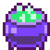
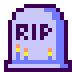
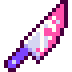

# 🍭 Mis soluciones a [Halloween.dev](https://www.halloween.dev/) 🎃

Mis soluciones a los terroríficos retos de [Halloween.dev](https://www.halloween.dev/) hechos en JavaScript. Halloween.dev es una colección de retos de código para JavaScript para Halloween. ¡Pásatelo de miedo, aprende y mejora en programación!

<!-- ## 2024

  
Retos
 -->

 

  <table align="center">
		<thead>
			<tr>
				<th align="center">#</th>
				<th align="center"></th>
				<th>Reto</th>
				<th>Dificultad</th>
				<th>Caramelos</th>
				<th>Solución</th>
			</tr>
		</thead>
		<tbody>
			<tr>
				<td align="center">01</td>
				<td align="center"></td>
				<td><a href="https://www.halloween.dev/retos/2024/1">🧙‍♀️ Crea la poción perfecta</a></td>
				<td align="center"></td>
				<td align="center">460</td>
				<td align="center"><a href="./2024/01.md">Ver</a></td>
			</tr>
			<tr>
				<td align="center">02</td>
				<td align="center"></td>
				<td><a href="https://www.halloween.dev/retos/2024/2">🧟 Horda de zombies</a></td>
				<td align="center"></td>
				<td align="center">460</td>
				<td align="center"><a href="./2024/02.md">Ver</a></td>
			</tr>
			<tr>
				<td align="center">03</td>
				<td align="center"></td>
				<td><a href="https://www.halloween.dev/retos/2024/3">🛌 Escapa de la pesadilla de Freddy</a></td>
				<td align="center"></td>
				<td align="center">300</td>
				<td align="center"><a href="./2024/03.md">Ver</a></td>
			</tr>
			<tr>
				<td align="center">04</td>
				<td align="center"></td>
				<td><a href="https://www.halloween.dev/retos/2024/4">🔪 Encuentra al asesino</a></td>
				<td align="center"></td>
				<td align="center">430</td>
				<td align="center"><a href="./2024/04.md">Ver</a></td>
			</tr>
			<tr>
				<td align="center">05</td>
				<td align="center"></td>
				<td><a href="https://www.halloween.dev/retos/2024/5">▲ Terror en Silent Hill</a></td>
				<td align="center"></td>
				<td align="center">0</td>
				<td align="center"><a href="./2024/05.md">Ver</a></td>
			</tr>
		</tbody>
	</table>

<!-- 
 -->

 

## Más retos

<table align="center">
	<thead>
		<tr>
			<th>
				
			</th>
			<th>
				
			</th>
			<th>
				
			</th>
		</tr>
	</thead>
</table>